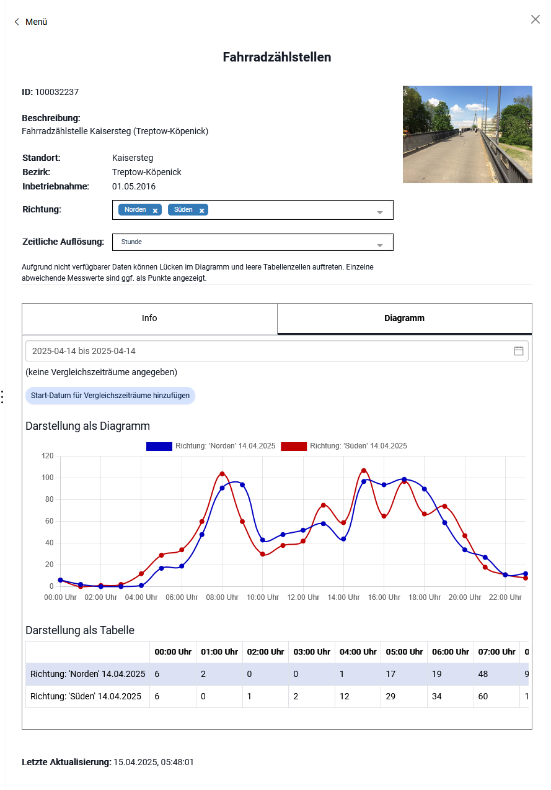

Entwicklung Masterportal Addon SensorChart (gfiTheme)
======================================================
[Masterportal](https://bitbucket.org/geowerkstatt-hamburg/masterportal/src/dev/) SensorChart Addon zur Verwendung in der "Digitale Plattform Stadtverkehr - Berlin"-Plattform.


Das Plugin ist eine Weiterentwicklung des [TrafficCount-Plugins](https://github.com/digitale-plattform-stadtverkehr-berlin/masterportal-addon-traffic-count) und dient zur Darstellung von Messwerten aus einem STA-Server.

Das Plugin ist mit der Masterportal Version 2.40.1 getestet.

Das Addon im Einsatz kann in der [Digitalen Plattform Stadtverkehr Berlin](https://viz.berlin.de/site/_masterportal/berlin/index.html?Map/layerIds=basemap_raster_farbe,TEU,EcoCounter&visibility=true,true,true&transparency=0,0,0&Map/zoomLevel=4) betrachtet werden.
Die dazu passende [Konfiguration](https://github.com/digitale-plattform-stadtverkehr-berlin/masterportal-dps-config/blob/master/resources/services-internet.json) steht ebenfalls zu Verfügung 


## SensorChart Parameter

Werden an das SensorChart Plugin als gfi Theme Parameter angegeben.

**headerProperties**

Eigenschaften die im oberen Bereich des GFI-Fensters angezeigt werden. Es gibt zwei Arten von Properties die angegeben werden können:

1. Eigenschaften aus den Properties der Things die aufgelistetet werden.
2. Eigenschaften aus den Properties der Datastreams deren Werte als Auswahl-Box präsentiert werden und der Auswahl des anzuzeigenden Datastreams dient.

**headerPhotos**

Boolean-Wert der angibt, ob die Properties der Things ein Parameter photos beinhalten zur Anzeige von Bildern (Derzeit wird nur die Anzeige von einem Bild unterstützt).

**archiveStartDate**

String, der den Anfang der Anzeige von archivierten Daten für die Woche und die Jahr Akkumulationen angibt.
Kein Pflichtparameter. Default "2020-01-01",

**intervals**

Angaben zu dem Datastream-Property das Informationen über die Intervall-Größen der Datenreihe beinhaltet.

**infoSelects**

Angaben welche der gewählten Datastreams-Properties zur Befüllung des Info-Tabs überschrieben werden.

### Vollständiges Beispiel Parameter:

```
    "gfiTheme": {
      "name": "sensorChart",
      "params": {
        "headerProperties": {
          "location": "Standort",
          "district":  "Bezirk",
          "installationDate": "Inbetriebnahme",
          "direction": {
            "name": "Richtung",
            "isSelect": true,
            "default": "Beide"
          },
          "periodLengthLabel": {
            "name": "Zeitliche Auflösung",
            "isSelect": true,
            "default": "Stunde"
          }
        },
        "headerPhotos": true,
        "archiveStartDate": "2015-01-01",
        "intervals": {
          "field": "periodLengthLabel",
          "values": {
            "15 Minuten": {"unit":  "minutes", "value":  15, "startOf":  "day", "defaultLength":  1, "maxLength": 90 },
            "Stunde": {"unit":  "hours", "value":  1, "startOf":  "day", "defaultLength":  1, "maxLength": 366},
            "Tag": {"unit":  "days", "value":  1, "startOf":  "day", "defaultLength":  7, "maxLength": 3660},
            "Woche": {"unit":  "days", "value":  7, "startOf":  "isoWeek", "selectWeek":  true, "defaultLength":  52, "maxLength": 520},
            "Monat": {"unit":  "months", "value":  1, "startOf":  "month", "defaultLength":  12, "maxLength": 120},
            "Jahr": {"unit":  "years", "value":  1, "startOf":  "year", "defaultLength":  5, "maxLength": 20}
          }
        },
        "infoSelects": {
          "day": {"periodLengthLabel":  "Stunde"},
          "week": {"periodLengthLabel":  "Woche"},
          "month": {"periodLengthLabel":  "Tag"},
          "year": {"periodLengthLabel":  "Tag"}
        }
      }
    }
```
